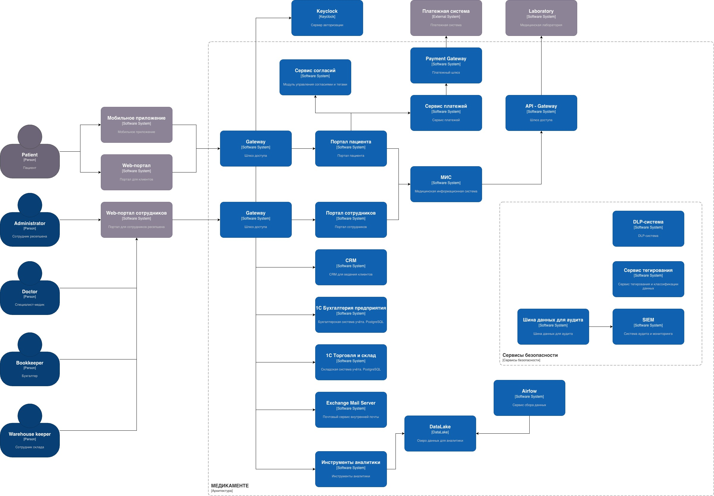

# Сдача проектной работы 10 спринта

## Задание 1. Анализ безопасности системы

### Выявите конфиденциальные данные

Рассмотрим несколько процессов и построим диаграммы потоков данных верхнего уровня по ним:

#### 1. Регистрация пациентов в системе

#### 2. Запись пациентов на прием

#### 3. Оплата услуг

### Проведите аудит мер по обеспечению безопасности данных

Проблемные зоны:

- Отсутствие разграничения доступа к данным пациентов
Любой сотрудник, прошедший доменную аутентификацию, имеет доступ к общему диску с данными клиентов.

- Файловый режим работы 1С
Критичные базы бухгалтерского и складского учета работают в режиме файловой СУБД.

- Отсутствие аудита действий пользователей
Системы не логируют, кто, когда и зачем открывал медицинскую карту или менял финансовый документ.

- Неструктурированное хранение чувствительных данных
Файлы Excel и скан-копии хранятся хаотично, дублируются, нет версионности.

- Отсутствие шифрования данных
Данные хранятся и передаются в открытом виде.

- Опасная обработка платежных данных.
Взаимодействие с ККМ и Excel при двойном учете может нарушать требования безопасности платежных карт.

- Размытие ролей в IT.
Администратор сети делает всё, технический директор совмещает роль архитектора и разработчика. 
Нет разделения на разработку и эксплуатацию (конфликт интересов).

- Уязвимость к атакам
Открытый доступ по сети к общим папкам и файловым базам 1С делает их идеальной целью для вирусов, которые могут зашифровать всё разом.

### Подумайте, что можно улучшить

#### Список данных для защиты и методы их защиты

##### Персональные данные (общие):
- Шифрование при хранении и передаче
- Обфускация в интерфейсах для сотрудников, не имеющих прямого доступа
- Обезличивание для аналитики, отчетов, обучения моделей
##### Медицинские персональные данные:
- Шифрование обязательно AES-256 для файлов и БД
- Обезличивание для исследований и статистики, с удалением прямых идентификаторов
##### Финансовые данные пациентов:
- Шифрование токенизация или шифрование PAN
- Маскирование номера карты
- Обезличивание для внутренней отчетности
##### Финансовые данные компании:
- Шифрование файлов
- Обфускация - ограничение видимости сумм в отчетах для разных ролей
- Обезличивание при передаче в аналитику
##### Учетные данные сотрудников:
- Шифрование ключей, хеширование

#### Определение меток

Создадим иерархию меток на основе категорий данных:

##### Уровень конфиденциальности:
- PUBLIC – общедоступная информация
- INTERNAL – внутренние данные
- CONFIDENTIAL – конфиденциальные данные
- RESTRICTED – ограниченного доступа
##### Категория по типу:
- PERSONAL - персональная информация
- MEDICAL - медицинская информация
- FINANCIAL - финансовая информация
##### Признак обезличивания:
- RAW – исходные данные
- ANONYMIZED – обезличенные

#### Способы присвоения меток

- Автоматическое тегирование
  - На уровне файлового сервера: с помощью скриптов или встроенных средств классификации Windows Server
  - В базах данных 1С добавление служебных полей с метками для каждой записи
- Ручное тегирование
  - Обучение сотрудников ресепшена и медперсонала проставлять метки при создании документа

#### Инструменты, способы и меры обеспечения конфиденциальности данных

- Организационные меры:
  - Разработка и внедрение политик безопасности
  - Регулярные тренинги для всех сотрудников
- Технические меры
  - Шифрование каналов связи: Внедрение TLS для всех внутренних сервисов
  - Управление доступом и аутентификация 
  - Динамический контроль доступа (Dynamic Access Control): Настройка в Windows Server с использованием меток данных и атрибутов пользователей. 
  - Принцип минимальных привилегий 
  - Защита данных при хранении 
    - Шифрование дисков сервера 
    - Шифрование файлов и папок
  - Мониторинг и аудит
    - Включение аудита в Windows: Аудит доступа к файлам и папкам
    - Аудит-система: Внедрение ELK Stack для сбора и анализа логов, выявления аномалий
    - DLP-система: Для контроля передачи данных за пределы компании

#### Кратко отразил на текущем процессе
Отражено, где нужен аудит, шифрование, маскирование данных.

##### 1. Регистрация пациентов в системе

##### 2. Запись пациентов на прием

##### 3. Оплата услуг

## Задание 2. Проектирование решения

На схему добавлены дополнительные компоненты, которые обеспечат требования безопасности согласно Privacy by Design

Ключевые компоненты, которые необходимо добавить в архитектуру:

- Сервис управления согласиями
- Сервис тегирования и классификации данных
- Сервис управления доступом
- API Gateway с политиками безопасности
- Шина данных для аудита (Audit Logging Bus)
- Сервис аудита и мониторинга
- Airflow для сбора данных и Data Lake

Для упрощения проставлены основные связи между бизнес компонентами, считаем что данные попадают в системы сбора данных
централизованно с помощью стандартных единых механизмов и сайдкаров.

